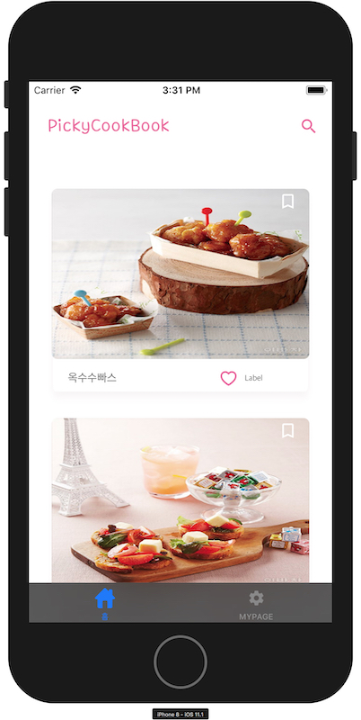
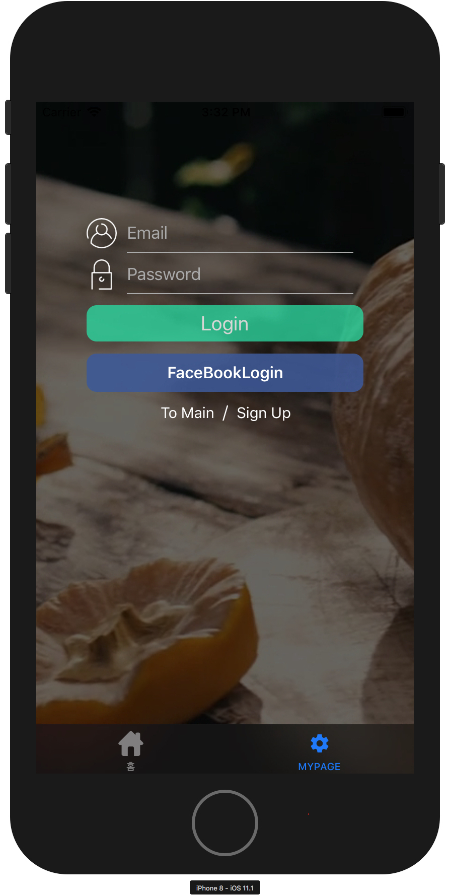

# 패스트캠퍼스 프로젝트 PickyCookbook

팀프로젝트 iOS개발자 3인이 의기투합하여 앱을 만들었습니다.

# 기능
- Facebook Login
- 레시피 만들기 (스텝별 과정 입력)
- 평가하기 기능
- 북마크 리스트 작성

# 동영상 주소
https://youtu.be/lFqNaQ3gpi8

# 사용한 Open Source

 - Alamofire : https://github.com/Alamofire/Alamofire
 - SwiftyJSON : https://github.com/SwiftyJSON/SwiftyJSON
 - FacebookLogin : https://developers.facebook.com/docs/facebook-login/v2.2?locale=ko_KR
 - DTTextField : https://github.com/iDhaval/DTTextField
 - RAMPaperSwitch : https://github.com/Ramotion/paper-switch
 
# 이미지

